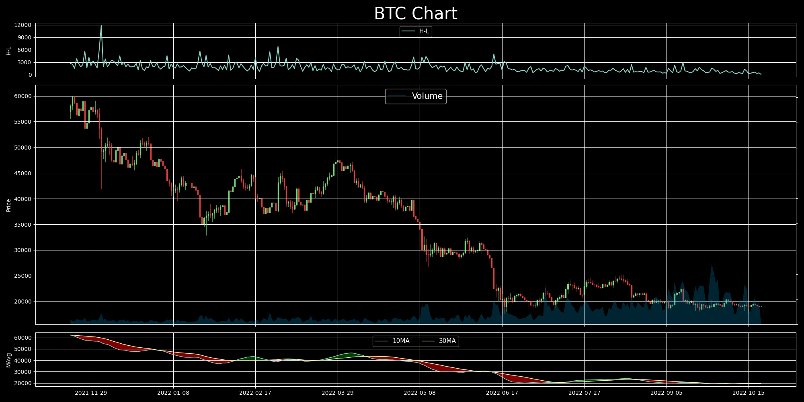
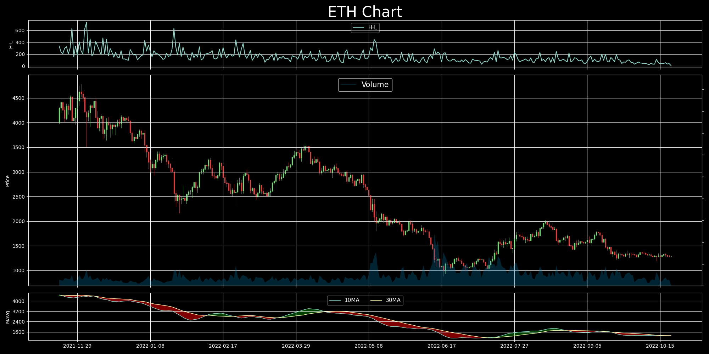
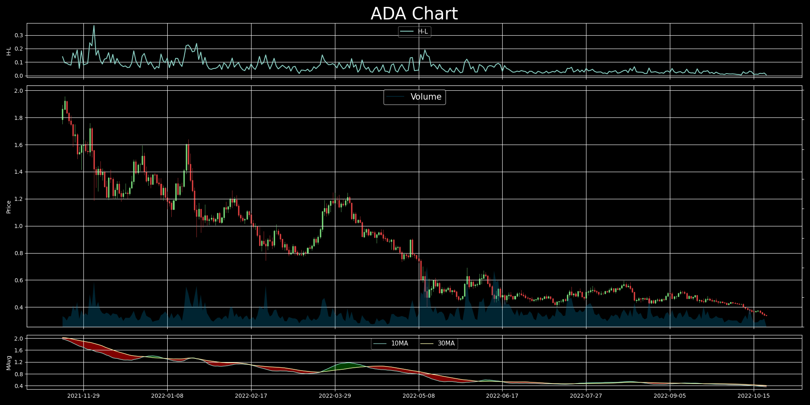
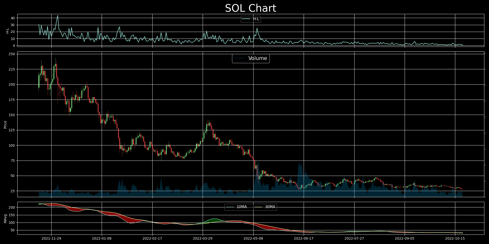
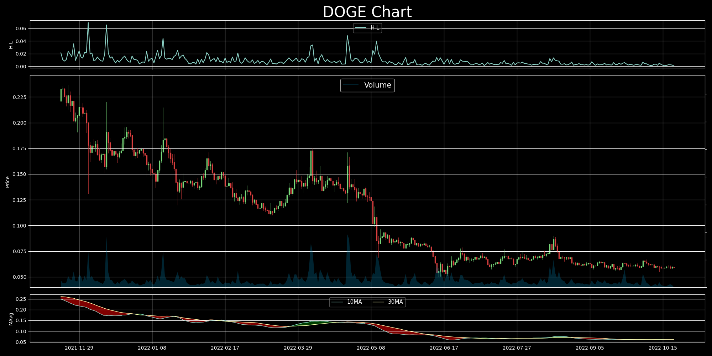
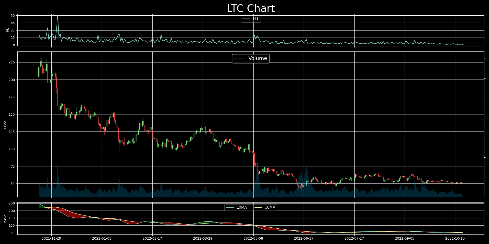

### `Bitcoin` Chart


### `Ethereum` Chart


### `Cardano` Chart


### `Solana` Chart


### `Dogecoin` Chart


### `Litecoin` Chart


## Python Code

```python
import datetime as dt
import pandas as pd
from fastquant import get_crypto_data
from matplotlib import dates as mdates
from matplotlib import pyplot as plt
from matplotlib import style
from matplotlib import ticker as mticker
from mplfinance.original_flavor import candlestick_ohlc

style.use("tableau-colorblind10")


def plot_graph(crypto):
    prev_year = dt.date.today() - pd.offsets.DateOffset(years=1)
    today = dt.date.today()

    df = get_crypto_data(f"{crypto}/USDT", str(prev_year.date()), str(today))

    data = df.copy()
    data = data.reset_index()
    data.rename(columns={"dt": "Date"}, inplace=True)
    data["Date"] = pd.to_datetime(data.Date)
    data["Date"] = mdates.date2num(data["Date"].values)
    data['MA10'] = data['close'].rolling(10).mean()
    data['MA30'] = data['close'].rolling(30).mean()
    data["H-L"] = data.high - data.low
    data.dropna(inplace=True)

    fig = plt.figure(figsize=(20, 10), facecolor="#f0f0f0")

    # AXIS 1
    ax1 = plt.subplot2grid((12, 1), (0, 0), rowspan=2, colspan=1)
    plt.title(crypto)
    plt.ylabel('H-L')

    # AXIS 2
    ax2 = plt.subplot2grid((12, 1), (2, 0), rowspan=8, colspan=1, sharex=ax1)
    plt.ylabel('Price')

    ax2v = ax2.twinx()

    # AXIS 3
    ax3 = plt.subplot2grid((12, 1), (10, 0), rowspan=2, colspan=1, sharex=ax1)
    plt.ylabel('MAvg')

    # AXIS 1
    ax1.plot(data["Date"], data['H-L'], "-", label="H-L")

    ax1.grid(True)

    ax1.yaxis.set_major_locator(mticker.MaxNLocator(nbins=5, prune="lower"))

    # AXIS 2
    candlestick_ohlc(ax2, data.values, width=0.4,
                     colorup="#77d879", colordown="#db3f3f")

    ax2.grid(True)

    ax2.yaxis.set_major_locator(mticker.MaxNLocator(nbins=10, prune="upper"))

    # ax2.text(data.iloc[len(data)//2, 0], data.iloc[-1, -1], "Crypto Prices")

    bbox_props = dict(boxstyle="round", fc="w", ec="k", lw=1)
    ax2.annotate(str(data.iloc[-2, -1].round(2)), (data.iloc[1, -1], data.iloc[-2, -1]),
                 xytext=(data.iloc[1, -1], data.iloc[-2, -1]), bbox=bbox_props)

    ax2v.plot([], [], color="#0079a3", alpha=0.3, label="Volume")
    ax2v.fill_between(data["Date"], 0, data['volume'],
                      facecolor="#0079a3", alpha=0.3)

    ax2v.yaxis.set_major_locator(mticker.MaxNLocator(nbins=10, prune="upper"))
    ax2v.axes.yaxis.set_ticklabels([])
    ax2v.grid(False)
    ax2v.set_ylim(0, 4*data['volume'].max())

    # AXIS 3
    ax3.plot(data["Date"], data["MA10"], linewidth=1, label="10MA")
    ax3.plot(data["Date"], data["MA30"], linewidth=1, label="30MA")

    ax3.fill_between(data["Date"], data['MA10'], data['MA30'], where=(
        data['MA10'] < data['MA30']), facecolor='r', edgecolor='r', alpha=0.5)
    ax3.fill_between(data["Date"], data['MA10'], data['MA30'], where=(
        data['MA10'] > data['MA30']), facecolor='g', edgecolor='g', alpha=0.5)

    ax3.grid(True)

    ax3.xaxis.set_major_formatter(mdates.DateFormatter("%Y-%m-%d"))
    ax3.xaxis.set_major_locator(mticker.MaxNLocator(10))
    ax3.yaxis.set_major_locator(mticker.MaxNLocator(nbins=5, prune="upper"))

    # for label in ax3.xaxis.get_ticklabels():
    #     label.set_rotation(45)

    plt.setp(ax1.get_xticklabels(), visible=False)
    plt.setp(ax2.get_xticklabels(), visible=False)

    # plt.subplots_adjust(left=0.11, bottom=0.24, right=0.90,
    #             top=0.90, wspace=0.2, hspace=0)
    plt.tight_layout()

    ax1.legend()
    leg = ax1.legend(loc=9, ncol=1, prop={"size": 11})
    leg.get_frame().set_alpha(0.4)

    ax2v.legend()
    leg = ax2v.legend(loc=9, ncol=1, prop={"size": 15})

    ax3.legend()
    leg = ax3.legend(loc=9, ncol=2, prop={"size": 11})
    leg.get_frame().set_alpha(0.4)

    plt.show()
    fig.savefig(f"{crypto}.png")


if __name__ == "__main__":
    assets = ["BTC", "ETH", "ADA", "SOL", "DOGE", "LTC"]
    for asset in assets:
        plot_graph(asset)
```